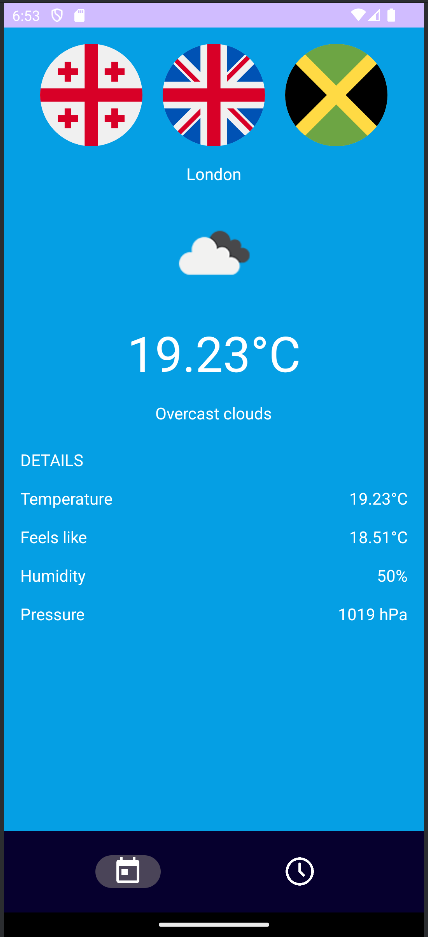
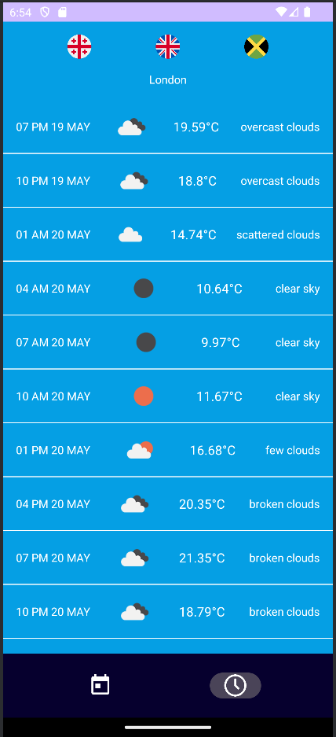

# 🌦️ Weather Forecast App

An Android weather application that provides current weather data and a 24-hour forecast. Built with Kotlin and XML-based UI using **ViewBinding**, **Retrofit**, and **OpenWeatherMap API**.

## ✨ Features

- 🌍 Multi country support with flag icons (e.g., Georgia 🇬🇪, UK 🇬🇧, Jamaica 🇯🇲)
- 🌤️ Current weather conditions
- 📆 Hourly forecast for the next 5 days
- 🌡️ Weather details: temperature, feels-like, humidity, and pressure
- 🖼️ Weather icons with Coil
- 🕒 Simple bottom navigation (Current | Forecast)

## 📸 Screenshots

| Current Weather | Hourly Forecast |
|-----------------|-----------------|
|  |  |

## 🔧 Tech Stack

- **Language**: Kotlin
- **UI**: ViewBinding + ConstraintLayout
- **Networking**: Retrofit + Gson + OkHttp Logging Interceptor
- **Image Loading**: Coil
- **Architecture**: MVVM (assumed from structure)

## 🛠️ Build Configuration

```groovy
compileSdk = 35
minSdk = 24
targetSdk = 35
jvmTarget = "11"
viewBinding = true
